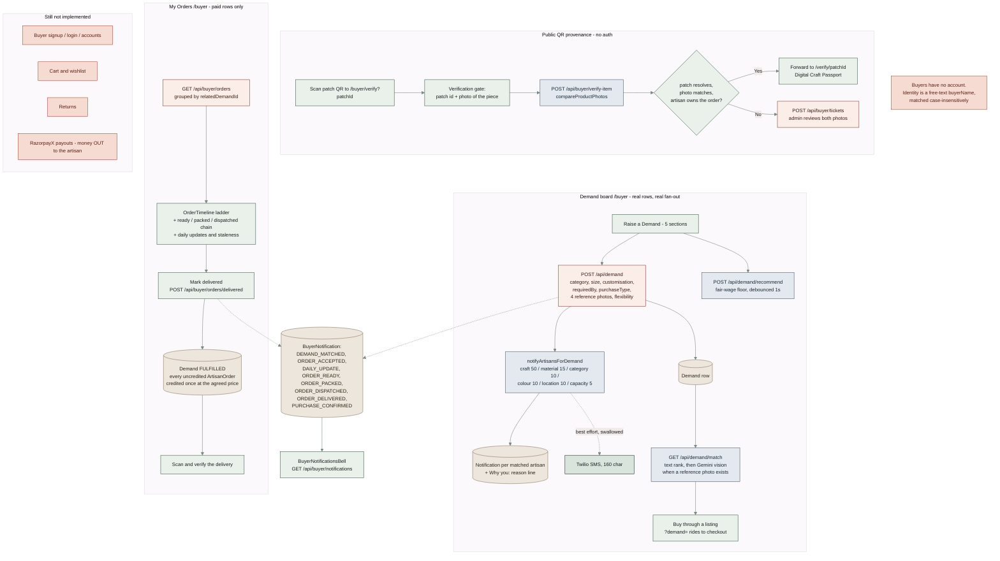
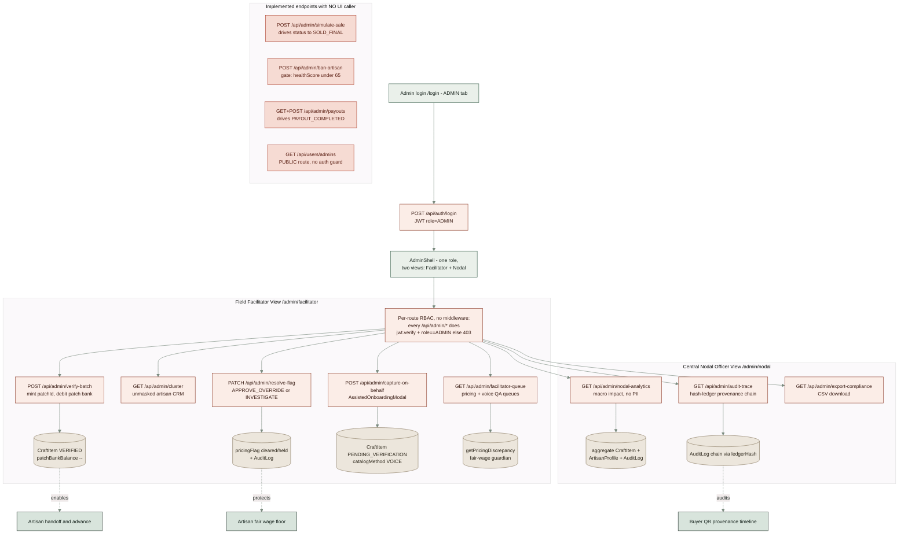

# Karigari — System Architecture (ground truth)

> Reverse-engineered directly from the repository: `prisma/schema.prisma`, all route handlers under `src/app/api`, the role pages under `src/app`, the modals under `src/components`, and the `src/lib` rules engines. UI→route bindings were confirmed by tracing every `fetch()`. Nothing is inferred beyond what the code executes.

## System facts

| Concern | Reality in code |
|---|---|
| Framework | Next.js **App Router** (TypeScript, React server + client components) |
| Data | **Prisma → PostgreSQL** via `PrismaPg` adapter. Models: `User`, `ArtisanProfile`, `CraftItem`, `AuditLog`, `SchemeApplication`, `Demand`, `ArtisanOrder`, `OrderLog`, `Notification`, `BuyerNotification`, `Ticket`, `Review`, `ResourceRequest`, `Creator`, `AffiliateClick`, `ShopifyShop` (V11) |
| Auth | **JWT** (`jsonwebtoken`) in an **httpOnly cookie** `auth-token` (7d), minted in one place (`src/lib/authSession.ts`). Three ways to get one: **password** (`bcryptjs`), **Google** (hand-rolled OAuth 2.0 + PKCE, `id_token` verified against Google's JWKS with `node:crypto` — no `next-auth`), and **passkeys** (`@simplewebauthn`). `User.authProvider` records which. Google and passkeys are for NEW accounts only: a Google sign-in on an email that already has a password account is **refused**, never auto-linked |
| RBAC | **No `middleware.ts`.** Every protected handler runs `jwt.verify()` then checks `decoded.role`; else `401/403` |
| Roles | Prisma `Role` enum is **`ADMIN | ARTISAN` only** — there is still **no Buyer role**. Buyers are identified by a free-text `buyerName` matched case-insensitively on `Demand`, `CraftItem`, `Review`, `Ticket` and `BuyerNotification`. This is why buyer alerts live in their own model rather than in nullable-user `Notification` rows |
| Admin model | One `ADMIN` role, two dashboard views: **Facilitator** (field, unmasked PII) and **Nodal** (macro, no PII) |
| AI | Google **Gemini** (`@google/genai`) for vision/valuation/voice; **OpenAI Whisper** for STT. All fall back to simulated output if keys are absent. Background removal runs **on the device** (`@imgly/background-removal`, WebGPU + worker) or, behind `SERVER_CUTOUT_ENABLED`, **on the server** (`@imgly/background-removal-node`). Gemini image models are asked for **empty backdrops only**, never a product — and the free-tier key has no image quota, so that tier is absent in practice |
| Outbound commerce | **Shopify Admin GraphQL** (V11) — the only channel that performs a real outbound write. One platform store; each artisan's shop is a collection in it. Env-gated; every other syndication channel is export-only |
| Payments | **Razorpay Checkout is wired and live.** `/api/payments/create-order` opens it; `/api/payments/verify-payment` is the trust boundary and writes nothing until the HMAC signature checks out. The charge is a flat ₹1 demo amount (`paidAmountPaise`); the sale is always booked at the DISPLAYED price (`salePrice`). Money **out** to an artisan needs RazorpayX, which is not enabled — `/api/payments/settle-escrow` records each tranche as `SIMULATED`, never as a bank credit |

---

## 1. Artisan workflow

```mermaid
%%{init: {"theme":"base","themeVariables":{"fontFamily":"JetBrains Mono, ui-monospace, monospace","primaryColor":"#EAF0EA","primaryBorderColor":"#3D624F","primaryTextColor":"#16211B","lineColor":"#7A8A7E","fontSize":"13px"},"flowchart":{"curve":"basis","nodeSpacing":45,"rankSpacing":55}}}%%
graph TD
  classDef ui fill:#EAF0EA,stroke:#3D624F,color:#16211B;
  classDef api fill:#FBEDE7,stroke:#8F412F,color:#3A1E16;
  classDef db fill:#ECE6DC,stroke:#8A7B63,color:#2A2418;
  classDef ai fill:#E3E9EF,stroke:#4D5D6C,color:#1C2733;
  classDef flag fill:#F6DBD3,stroke:#B14B39,color:#5A1E12;
  classDef ext fill:#D8E4DC,stroke:#24332C,color:#14211B;

  START["Artisan visits Landing /"]:::ui --> AUTHCHK{"Has auth-token JWT cookie?"}
  AUTHCHK -->|No| REG["Register /register - ARTISAN tab"]:::ui
  AUTHCHK -->|Yes| DASH["Artisan Dashboard /artisan/dashboard"]:::ui
  PWA_SYNC["Offline IndexedDB Sync"]:::ext -. auto-flushes .-> CE
  IVR["Toll-Free AI IVR"]:::ext -. creates item .-> NEWITEM
  WA_HOOK["WhatsApp/SMS Webhook"]:::ext -. replies 1 to sell .-> RADV

  subgraph AUTH["Authentication and RBAC"]
    REG --> AREG["POST /api/auth/register<br/>bcrypt hash, sign JWT"]:::api
    LOG["Login /login"]:::ui --> ALOG["POST /api/auth/login<br/>verify + sign JWT"]:::api
    AREG --> COOKIE["Set httpOnly cookie<br/>auth-token, role=ARTISAN, 7d"]:::api
    ALOG --> COOKIE
  end
  AREG --> UDB[("User + ArtisanProfile<br/>role=ARTISAN")]:::db
  COOKIE --> DASH
  DASH --> GDASH["GET /api/artisan/dashboard<br/>role guard: ARTISAN"]:::api
  GDASH --> CIDB[("CraftItem aggregates:<br/>captures, advances, earnings")]:::db

  subgraph PROFILE["Profile Management"]
    DASH --> PROF["ProfileEditorModal"]:::ui
    PROF --> PPUT["PUT /api/artisan/profile<br/>upsert ArtisanProfile"]:::api
    PPUT --> PDB[("ArtisanProfile:<br/>socialCategory, upiId, income")]:::db
  end

  subgraph CAPTURE["Craft Capture and AI Valuation"]
    DASH --> CAP["CaptureModal"]:::ui
    CAP --> VP["POST /api/items/voice-parse<br/>Gemini STT + extract"]:::ai
    CAP --> STUDIO["PhotoStudio (V11)<br/>pre-check, retake, choose the look"]:::ui
    STUDIO --> VV["POST /api/items/vision-verify<br/>match, score, blur, exposure, retakeAdvice"]:::ai
    STUDIO --> BG["POST /api/items/background<br/>server cutout, env-gated"]:::api
    STUDIO --> BD["POST /api/items/backdrop<br/>empty backdrops only"]:::ai
    CAP --> CE["POST /api/items/capture<br/>fair-wage engine + look provenance"]:::api
    CE --> BENCH["validateArtisanClaim<br/>benchmark guardrail"]:::api
    CE --> NEWITEM[("CraftItem status<br/>PENDING_VERIFICATION")]:::db
    CE --> LOG1[("AuditLog: UPLOAD_CREATED")]:::db
  end
  NEWITEM -. hands off to .-> ADMINVER["ADMIN verify-batch mints patchId"]:::ext

  subgraph SELL["Handoff, Advance and Payout Routing"]
    DASH --> HAND["AgentHandoffModal"]:::ui
    HAND --> AVV["POST /api/artisan/vision-verify<br/>QR patch visual match"]:::ai
    HAND --> DAPPLY["POST /api/disbursement/apply<br/>selectedOption route"]:::api
    DAPPLY --> ROUTE{"Route chosen"}
    ROUTE -->|KARIGARI_ADVANCE| RADV[("ADVANCE_PAID<br/>advancePaid = fairWageFloor")]:::db
    ROUTE -->|MIDDLEMAN| RMID[("SOLD_MIDDLEMAN")]:::db
    ROUTE -->|COOP_AUCTION| RAUC[("LISTED_AUCTION")]:::db
    DAPPLY --> HS["healthScore +2.5<br/>accountStatus recompute"]:::api
    DASH --> XC["CrossCheckModal"]:::ui
    XC --> XCE["POST /api/artisan/cross-check<br/>status TAG_ATTACHED"]:::api
  end

  subgraph SCHEMES["Government Scheme Tracking"]
    SCH["Schemes /artisan/schemes"]:::ui --> GSCH["GET /api/artisan/schemes<br/>evaluateAllSchemes"]:::api
    SCH --> SAPPLY["POST /api/artisan/schemes/apply<br/>re-evaluated server-side"]:::api
    GSCH --> ELIG["loadEligibilitySnapshot<br/>rules engine schemes.ts"]:::api
    SAPPLY --> SADB[("SchemeApplication<br/>status APPLIED")]:::db
    SAPPLY -. opens .-> GOV["Official govt portal - EXTERNAL<br/>KARIGARI never submits"]:::ext
  end

  subgraph DISPUTE["Counterfeit Dispute"]
    DASH --> DISP["DisputeModal on FLAGGED item"]:::ui
    DISP --> RR["POST /api/artisan/request-review<br/>status APPLIED_FOR_REVIEW"]:::api
    RR --> RRDB[("CraftItem APPLIED_FOR_REVIEW")]:::db
  end

  RADV -. buyer scan sale .-> BUYER["Buyer QR verify /verify/patchId"]:::ext
  DASH --> VO["VoiceOnboarding<br/>/api/transcribe + /api/voice-assistant"]:::ai
  DASH --> INS["Insights /artisan/insights"]:::ui
  DASH --> MKT["Market /artisan/market<br/>listings, look picker, Syndication Hub"]:::ui
  MKT --> SYN["POST /api/artisan/syndicate<br/>EXPORT channels: payloads, not sent"]:::api
  MKT --> SHOP["POST /api/artisan/shopify/publish<br/>LIVE_PUBLISH: real Shopify product"]:::ext
```

**Routes:** `POST /api/auth/register`, `GET /api/artisan/dashboard`, `PUT /api/artisan/profile`, `POST /api/items/voice-parse`, `POST /api/items/vision-verify`, `POST /api/items/background`, `POST /api/items/backdrop`, `POST /api/items/capture` → `PENDING_VERIFICATION`, `GET|PATCH /api/artisan/listings` (incl. `?looks=` and `selectedImageVariant`), `POST /api/artisan/syndicate`, `GET /api/artisan/shopify`, `POST /api/artisan/shopify/publish`, `POST /api/artisan/vision-verify`, `POST /api/disbursement/apply` → `ADVANCE_PAID|SOLD_MIDDLEMAN|LISTED_AUCTION`, `POST /api/artisan/cross-check` → `TAG_ATTACHED`, `GET /api/artisan/schemes`, `POST /api/artisan/schemes/apply`, `POST /api/artisan/request-review` → `APPLIED_FOR_REVIEW`.

Fair-wage engine (in `/api/items/capture`): `fairWageFloor = laborDays*baseWage + rawMaterialCost + 10% overhead`. `/artisan/market` is **real**: the artisan's listings with editable ONDC copy, the production-stage ladder, the V11 look picker, and the Syndication Hub (export channels plus, when configured, the Shopify card). See §4 for the capture pipeline and the channel status machines.

---

## 2. Buyer workflow

**Real (public, no auth):** `/buyer` demand board and My Orders · `/buyer/verify` scan gate · `/verify/[patchId]` passport · `POST /api/demand` (+ fan-out) · `GET /api/demand/match` · `GET /api/demand/track` · `GET /api/buyer/orders` · `POST /api/buyer/orders/delivered` · `POST /api/buyer/orders/verify` · `POST /api/buyer/verify-item` · `GET|POST /api/buyer/notifications` · `POST /api/buyer/tickets` · Razorpay checkout and `POST /api/payments/verify-payment`.

**Identity boundary — read this before adding a buyer route.** Every one of those endpoints is public and scoped by an exact, case-insensitive `buyerName`. Anyone who knows the name can read that buyer's board and feed. Never widen the match to `contains` or a prefix, and never return a patch id, contact number or artisan payout field from a route reachable without the purchase behind it.

**[Not Yet Implemented]:** buyer accounts, cart, wishlist, returns, and RazorpayX payouts. The escrow ladder, the ledger fields and the audit trail are real; the bank credit at the end of it is not.

---

## 3. Admin workflow

**Facilitator:** `GET /api/admin/facilitator-queue`, `GET /api/admin/cluster`, `POST /api/admin/verify-batch` (`PENDING_VERIFICATION`→`VERIFIED`, mints `patchId`, debits `patchBankBalance`), `PATCH /api/admin/resolve-flag`, `POST /api/admin/capture-on-behalf`.
**Nodal:** `GET /api/admin/nodal-analytics`, `GET /api/admin/audit-trace` (hash-ledger), `GET /api/admin/export-compliance` (CSV).
**Implemented but NO UI caller:** `POST /api/admin/simulate-sale` → `SOLD_FINAL`; `POST /api/admin/ban-artisan`; `GET|POST /api/admin/payouts` → `PAYOUT_COMPLETED`; `GET /api/admin/dashboard` (legacy). **Open endpoint (no guard):** `GET /api/users/admins`.

---

## 4. End-to-end (CraftItem status spine)

```mermaid
%%{init: {"theme":"base","themeVariables":{"fontFamily":"JetBrains Mono, ui-monospace, monospace","primaryColor":"#EAF0EA","primaryBorderColor":"#3D624F","primaryTextColor":"#16211B","lineColor":"#7A8A7E","fontSize":"13px"},"flowchart":{"curve":"basis","nodeSpacing":40,"rankSpacing":60}}}%%
graph LR
  classDef art fill:#EAF0EA,stroke:#3D624F,color:#16211B;
  classDef adm fill:#E3E9EF,stroke:#4D5D6C,color:#1C2733;
  classDef buy fill:#FBEDE7,stroke:#8F412F,color:#3A1E16;
  classDef sys fill:#ECE6DC,stroke:#8A7B63,color:#2A2418;
  classDef flag fill:#F6DBD3,stroke:#B14B39,color:#5A1E12;

  A1["ARTISAN registers + profile<br/>/api/auth/register"]:::art --> A2["Capture craft + AI valuation<br/>/api/items/capture"]:::art
  A2 --> S1[("PENDING_VERIFICATION")]:::sys
  S1 --> AD1["ADMIN verify-batch<br/>mints patchId, debits bank"]:::adm
  AD1 --> S2[("VERIFIED + patchId")]:::sys
  S2 --> A3["ARTISAN handoff:<br/>cross-check + route choice"]:::art
  A3 --> S3[("ADVANCE_PAID /<br/>SOLD_MIDDLEMAN /<br/>LISTED_AUCTION")]:::sys
  S3 --> B1["BUYER scans QR<br/>/verify/patchId"]:::buy
  B1 --> B2["AI authenticity camera<br/>/api/verify-authenticity"]:::buy
  B2 --> S4[("SOLD_FINAL")]:::sys
  B2 -. fail after grace .-> SF[("FLAGGED - healthScore -15")]:::flag
  SF --> A4["ARTISAN dispute<br/>/api/artisan/request-review"]:::art
  A4 --> S5[("APPLIED_FOR_REVIEW")]:::sys
  S4 --> AD2["ADMIN payouts - NO UI yet<br/>/api/admin/payouts"]:::adm
  AD2 --> S6[("PAYOUT_COMPLETED")]:::sys
  S4 --> AD3["ADMIN nodal: ledger + analytics"]:::adm
  S3 -. parallel track .-> SC["ARTISAN schemes:<br/>eligibility + apply tracker"]:::art
  LEDGER["Every transition writes an immutable AuditLog - hash-ledger provenance"]:::sys
  S1 -. logs .-> LEDGER
  S4 -. logs .-> LEDGER
  S6 -. logs .-> LEDGER
```

### CraftItem status machine
`PENDING_VERIFICATION → VERIFIED → TAG_ATTACHED → (ADVANCE_PAID | SOLD_MIDDLEMAN | LISTED_AUCTION | PENDING_DISBURSEMENT) → SOLD_FINAL → PAYOUT_COMPLETED`; penalty branch `FLAGGED → APPLIED_FOR_REVIEW`. Every transition writes an immutable `AuditLog` row (hash-ledger via `ledgerHash`).

### Capture pipeline — the Photo Studio (V11)

Step 2 of `CaptureModal` runs `usePhotoStudio()` (`src/components/PhotoStudio.tsx`). Off with `NEXT_PUBLIC_PHOTO_STUDIO_ENABLED=false`, which restores the pre-V11 single auto-enhanced frame.

| Stage | Where | What is true |
|---|---|---|
| 1. Pre-check | `assessPhotoLocally()` · `src/lib/photoQuality.ts` | On-device blur (Laplacian variance) and exposure on a 256 px thumbnail. **Warns only** — never produces a retake. Thresholds calibrated on 80 seed photos. |
| 2. Verdict | `POST /api/items/vision-verify` → `adviseRetake()` · `src/lib/photoGate.ts` | One Gemini call on the **camera frame**. `PASS \| SOFT \| RETAKE`. RETAKE only for a mismatch, severe blur, score ≤ 3, or bad exposure at score ≤ 4; after one retake, never again. An unreadable model reply is `scoreSource: FALLBACK`; a 5xx is "check unavailable". Neither shows an "AI checked" claim, and `photoQualitySource` records `AI \| HEURISTIC \| UNCHECKED`. |
| 3. Cutout | `obtainCutout()` · `src/lib/imageEnhance.ts` | `ON_DEVICE` (WebGPU + worker) → `SERVER` (`/api/items/background`, when enabled) → `NONE`. `assessCutout()` discards a cutout that cut into the craft (calibrated on 60 seed photos) and says so. |
| 4. Looks | `buildPhotoVariants()` | Original (first, always), Enhanced, five canvas presets drawn from theme tokens, and at most two looks on Gemini-generated **empty** backdrops. The cutout is always drawn last. |
| 5. Pick | `LookGallery` radiogroup | The pick becomes `images[0]`. Changeable later on `/artisan/market`; locked once `paidAt` is set. |
| 6. Persist | `POST /api/items/capture`, `POST /api/items/complete-draft` | `src/lib/photoStudioPayload.ts` caps: ≤ 4 photos × 2 MB; original ≤ 2 MB; enhanced ≤ 1 MB; ≤ 8 thumbnails; cutout ≤ 700 KB; blob ≤ 1.2 MB — optional data is dropped, never the capture. Measured: a 4.78 MB camera photo stores as 549 KB in total. |

**Provenance, enforced twice.** (1) Every authenticity comparator — `verifyBuyerImage`, `verify-ready`, `attach-verify`, `verify-authenticity` — reads `provenanceReference(item) = originalImageUrl ?? images[0]`, so a chosen look is never what a delivered piece is judged against. (2) `enforceLookProvenance()` (`src/lib/lookProvenance.ts`) proves on the server that a non-Original look's product pixels come from the camera frame — gradient-structure correlation, frame → cutout → look, calibrated so every genuine look passed and every substituted or redrawn product in the set failed. A look that fails or cannot be proven is replaced by the camera frame and noted. The listing picker's PATCH refuses such a look with 422.

### Syndication channels and the Shopify status machine (V11)

`SyndicationPlatform.mode` separates the two kinds of channel **structurally**:

- `EXPORT` — Paytm/Magicpin (ONDC), GeM, Amazon Karigar. `POST /api/artisan/syndicate` stamps `syndicatedChannels` and builds payloads. **Nothing is transmitted.** `normalizePlatforms()` accepts only EXPORT keys, so the master switch can never stamp a live channel.
- `LIVE_PUBLISH` — the artisan's Shopify shop. Written only by `POST /api/artisan/shopify/publish`, only after Shopify confirms.

**The model.** Shopify's Admin API cannot create stores: ONE platform store, provisioned by hand; each artisan's shop is a custom collection `karigari-<name>-<8 hex of id>`, published to the Online Store, with their name as every product's vendor. `ShopifyShop` (one per artisan, `@unique artisanId`) is claimed before any Shopify write, so concurrent first publishes create exactly one collection.

`CraftItem.shopifyStatus`: `null / NOT_PUBLISHED → PUBLISHING → LIVE`; `PUBLISHING → FAILED → PUBLISHING` on Retry; `LIVE → WITHDRAWN` (terminal).

| Transition | Endpoint / function | Guard |
|---|---|---|
| claim `→ PUBLISHING` | `POST /api/artisan/shopify/publish` | owner (403 otherwise); `unpurchasableReason() === null`; a price; a photo; guarded `updateMany` — a fresh claim returns 409, a claim older than 3 min is taken over |
| `→ LIVE` | same, after `ensureArtisanShop()` → `publishProduct()` | `productSet` upserts by the deterministic handle `karigari-<patch>-<8 hex of item id>`, so a retry updates rather than duplicates. `shopifyProductId` is written the moment Shopify returns it. |
| `→ FAILED` + `shopifySyncError` | same | An actionable sentence per failure: auth, missing scope, throttled, refused listing, network, wrong currency. A failed update of a LIVE product stays `LIVE` with the error. |
| `LIVE → WITHDRAWN` | `withdrawSoldPiece()` in `after()` of `POST /api/payments/verify-payment` and `POST /api/admin/simulate-sale` | Sold on Karigari → the Shopify product is set to DRAFT. If Shopify refuses, the row stays LIVE and says so. |

Price on Shopify is `salePrice ?? getListingPrice(item)` in **rupees**. The ₹10 demo charge and ₹4 advance never reach a listing, and a non-INR store is refused. With `SHOPIFY_LOCATION_ID`, a piece is stock-tracked at quantity 1 with `inventoryPolicy: DENY`, set on first publish only. Orders placed on Shopify are fulfilled in Shopify admin; they do not enter Karigari's escrow.

### Demand + ArtisanOrder status machine (V9)

Two ordered vocabularies, both monotonic. Every writer goes through
`advanceDemandStatus()` / `advanceOrderStatus()` in `src/lib/orderStage.ts`;
an endpoint that assigns a status literal is a bug.

`Demand.status`: `OPEN → MATCHED → IN_PRODUCTION → FULFILLED`
`ArtisanOrder.status`: `ACCEPTED → IN_PROGRESS → READY → PACKED → DISPATCHED → DELIVERED → COMPLETED`

`CANCELLED` is in both vocabularies because `POST /api/artisan/orders` refuses
to accept against a cancelled demand, but **nothing in this app writes it**.

| Transition | Demand | ArtisanOrder | Endpoint | Actor |
|---|---|---|---|---|
| Buyer posts | `OPEN` | — | `POST /api/demand` | buyer (public) |
| Artisan accepts | `→ MATCHED` | *create* `ACCEPTED` | `POST /api/artisan/orders` | artisan |
| First daily update | `→ IN_PRODUCTION` | `→ IN_PROGRESS` + `lastLogAt` | `POST /api/artisan/orders/log` | artisan |
| Ready check passes | — | `→ READY` + `craftItemId` bound | `POST /api/artisan/orders/verify-ready` | artisan |
| Ready check fails | — | **nothing written** | same | artisan |
| Packs | — | `→ PACKED` + `packedAt` | `PATCH …` `action:"pack"` | artisan |
| Dispatches | — | `→ DISPATCHED` + `dispatchedAt` | `PATCH …` `action:"dispatch"` | artisan |
| Closes the job | — | `→ COMPLETED` (needs `readyVerified`) | `PATCH …` `action:"complete"` | artisan |
| Buyer pays | `→ MATCHED` or `FULFILLED` | binds `craftItemId`, `→ IN_PROGRESS` | `POST /api/payments/verify-payment` | buyer (post-HMAC) |
| Buyer marks delivered | `→ FULFILLED` + `deliveredAt` | `→ DELIVERED` + credit | `POST /api/buyer/orders/delivered` | buyer |

**The buyer-facing ladder stays six rungs** — `PLACED · ACCEPTED · IN_PRODUCTION ·
QUALITY_CHECK · DISPATCHED · DELIVERED`. `READY` and `PACKED` both map onto
`QUALITY_CHECK`. A seventh rung would appear on every storefront `CraftItem`
timeline too, where nothing ever packs, leaving a rung that could never fill.

**The ready check is the gate.** `PATCH action:"complete"` requires
`readyVerified === true`, so the pre-V9 path — any 2 MB photo, straight to
COMPLETED — no longer exists. The check itself resolves the scanned patch to a
`CraftItem` **owned by the calling artisan**, and binds it to the order. That
binding is what later lets `verifyBuyerImage()` ask "is this the piece that was
promised" instead of "does this artisan hold any order on this demand".

### The 40% demand advance (V10)

A fifth status rides alongside `ArtisanOrder.status`, because paying for work
and doing it are different clocks:

`ArtisanOrder.advanceStatus`: `ADVANCE_PENDING → ADVANCE_INITIATED → ADVANCE_PAID`,
plus `ADVANCE_WAIVED` set once at acceptance when no price could be resolved.

| Transition | Who | Endpoint |
|---|---|---|
| `ADVANCE_PENDING` + `advanceDueAmount` written | artisan accepts | `POST /api/artisan/orders` |
| `ADVANCE_WAIVED` when no price resolves | artisan accepts | same |
| `→ ADVANCE_INITIATED` | buyer | `POST /api/payments/demand-advance/create-order` |
| `→ ADVANCE_PAID`, `status → IN_PROGRESS` | buyer, **post-HMAC** | `POST /api/payments/demand-advance/verify` |

**The production gate.** `POST /api/artisan/orders/log`,
`POST /api/artisan/orders/verify-ready` and the `pack` / `dispatch` PATCH
actions all return **409** while `advanceStatus` is neither `ADVANCE_PAID` nor
`ADVANCE_WAIVED`. One predicate, in `src/lib/advanceGate.ts`. `complete` is
deliberately not gated: an order that reached DISPATCHED must stay closable.

**Two amounts, never conflated.** `advanceDueAmount` is the real 40% of the
agreed price and is what both sides are shown. `advanceChargedPaise` is the flat
₹4 Razorpay actually took. They live in different columns for the same reason
`CraftItem.salePrice` and `CraftItem.paidAmountPaise` do.

**The balance.** `/api/buyer/orders/delivered` credits `balanceDueAmount` when
the advance was paid and the full agreed price otherwise. Advance + balance
reconstructs the agreed price to the rupee.

---

---

## 5. Advanced SIH Workflows (Offline, Sync, Pooling, & Fallbacks)

To ensure **100% digital inclusion** and B2B scalability, KARIGARI implements four advanced resilience layers:

### 5.1 Offline Sync (PWA Local Storage)
**Goal:** Enable cataloging in zero-internet zones.
**Flow:**
1. Artisan opens the PWA (cached via service worker).
2. Uses the camera and dictates details.
3. If `navigator.onLine` is false, the app saves the `CraftItem` payload to the browser's **IndexedDB** (local storage).
4. The UI displays an `Offline Mode: Synced to Device` badge.
5. When the device reconnects to 4G, a background sync listener (or layout `useEffect`) automatically flushes the queue to `POST /api/items/capture`, generating the `UPLOAD_CREATED` audit logs retroactively.

### 5.2 WhatsApp / SMS Fallback (Low-Bandwidth Comm)
**Goal:** Reach artisans who have a feature phone or minimal data, bypassing the web app entirely.
**Flow:**
1. When a B2B buyer posts a bulk demand, the backend `notifyArtisansForDemand()` checks the artisan's connectivity.
2. If web is unreachable, the system triggers the **Twilio / Meta Cloud API Webhook** (`/api/webhooks/whatsapp`).
3. Artisan receives an SMS/WhatsApp: *"Demand for 50 Ikats. Reply 1 to accept."*
4. Artisan replies "1". The webhook parses the sender's number, matches the `ArtisanProfile`, and updates the `CraftItem` status to `ADVANCE_PAID` directly in the Prisma database.

### 5.3 Toll-Free AI IVR (Zero-Tech Fallback)
**Goal:** Absolute inclusion for the most marginalized artisans with no smartphone or SMS literacy.
**Flow:**
1. Artisan dials a toll-free number: **1800-KARIGARI**.
2. A **Bhashini-powered AI Voicebot** asks in the local dialect: *"What did you weave today?"*
3. The artisan replies, *"Two red silk sarees."*
4. The audio is transcribed and parsed via the same `/api/items/voice-parse` logic, and a `PENDING_VERIFICATION` item is inserted into the database. The NGO facilitator simply visits later to attach the physical QR patch.

### 5.4 Cluster Pooling (B2B ONDC Logistics)
**Goal:** Allow individual rural weavers to fulfill massive B2B wholesale orders by aggregating their inventory.
**Flow:**
1. An artisan uploads a saree. The AI Engine detects similar items uploaded by 9 other artisans in the same `clusterName` (e.g., *Pochampally Coop*).
2. The **ONDC Beckn Adapter** (`/api/ondc/catalog`) dynamically groups these 10 distinct items into a single **"Bulk B2B Listing"**.
3. A hotel chain on Paytm buys the bulk listing.
4. The Escrow disbursement API splits the incoming UPI payment into 10 separate micro-payouts, crediting each artisan individually while fulfilling the buyer's bulk requirement.

## Brief vs. code — gap analysis

| Assumed in brief | Status | What exists instead |
|---|---|---|
| Buyer signup / login / accounts | **[Not Yet Implemented]** | Free-text `buyerName`, matched case-insensitively on every public buyer route |
| Catalog browse / search / filters | **Implemented** | `/marketplace` + `GET /api/items/market`; demand-scoped ranking in `GET /api/demand/match` |
| Cart & wishlist | **[Not Yet Implemented]** | — |
| Razorpay checkout | **Implemented (money IN)** | Live keys, HMAC-verified in `verify-payment`. ₹1 demo charge; sale booked at the displayed price. Money OUT still `SIMULATED` |
| Order history / reviews | **Implemented** | `/buyer` My Orders (`GET /api/buyer/orders`), `POST /api/reviews`. Returns still absent |
| ONDC B2B listing | **Partial** | `/artisan/market` is real (listings, syndication hub, `GET /api/ondc/catalog`). Export channels prepare payloads and **do not transmit**. Its `buyers` tab is a read-only preview that deep-links to `/artisan/orders?tab=demands&demandId=` — one accept path, one source of truth |
| AI photo studio | **Implemented (V11)** | Lenient quality gate, cutout ladder, canvas looks, server-enforced look provenance. Generated backdrops built but absent on a free-tier Gemini key |
| Shopify artisan shops | **Implemented (V11), env-gated** | One store, a collection per artisan, real products via `productSet`, withdraw on sale. Verified against a stateful fake Admin API and an unreachable store — **not yet against a real store** |
| Product moderation / disputes | **Implemented** | `resolve-flag`, `request-review`, grace-period flagging |
| Payout / commission tracking | **Partial** | Endpoints + ledger exist and are exercised; RazorpayX is off, so each tranche is recorded `SIMULATED` and must never be described as paid |
| Buyer↔artisan order sync | **Implemented (V9)** | One lifecycle, `BuyerNotification` feed, ready/pack/dispatch chain, unified `GET /api/demand/track` |
| Google sign-in / passkeys | **Implemented (V10)** | New accounts only. Hand-rolled OAuth + PKCE, `@simplewebauthn` passkeys. Both env-flagged; password sign-in unchanged |
| Buyer advance on acceptance | **Implemented (V10)** | Real 40% shown and recorded, ₹4 charged, production gated until paid, balance credited on delivery |
| Artisan verification & RBAC | **Implemented** | `verify-batch`, per-route JWT role guards |
| Platform metrics & transaction logs | **Implemented** | `nodal-analytics`, `audit-trace`, CSV export |
