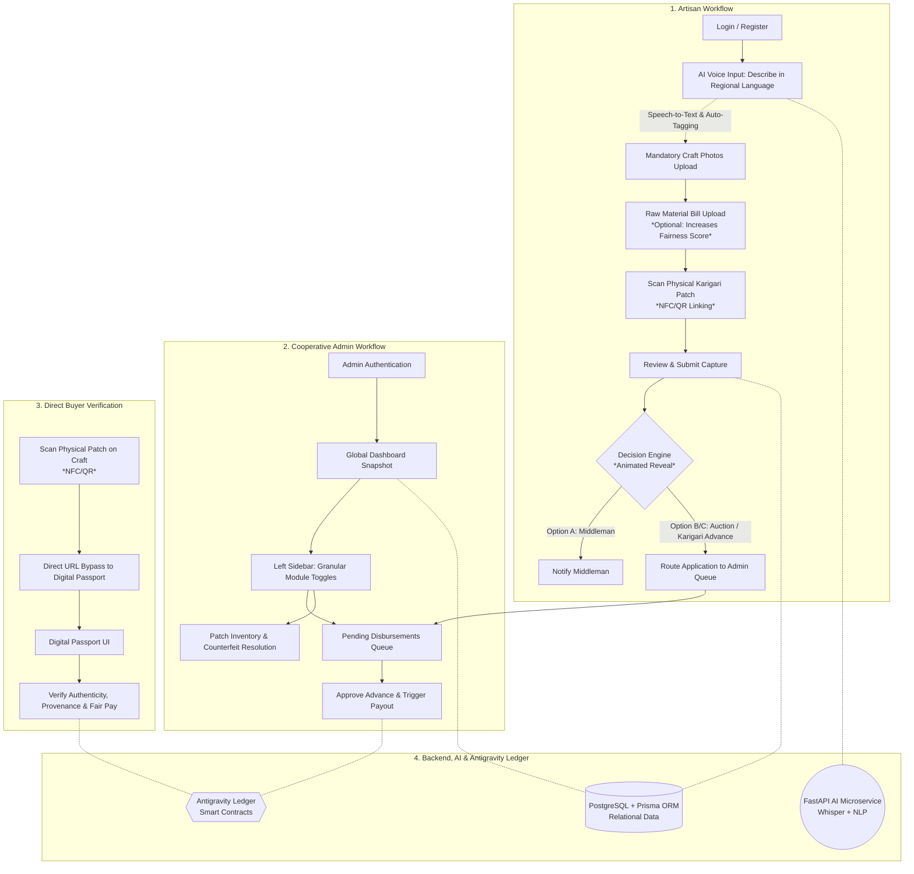

Markdown
# KARIGARI Cooperative Platform: Master Specification & Architecture

## 1. Project Overview & Mission

**KARIGARI** is an AI-powered decision engine and decentralized supply chain verification platform tailored for traditional artisan cooperatives. It bridges physical craftsmanship with verifiable digital provenance, transparent fair-wage pricing algorithms, and immediate financial liquidity.

### Core Objectives:
*   **Artisan Empowerment:** Low-barrier, voice-first digital onboarding in regional languages; eliminates middleman exploitation by providing algorithmic valuation and same-day cash advance applications.
*   **Cooperative Administration:** Macro-level dashboard oversight over artisans, cataloged inventory, fair-wage compliance metrics, disbursement approvals, and anti-counterfeiting tracking.
*   **Consumer & Buyer Trust:** Direct-to-consumer provenance verification via physical NFC/QR patch scans landing on an immutable "Digital Product Passport" (DPP).

---

## 2. System Architecture & Workflow Diagram


    
3. Technology Stack
Layer	Technology	Purpose
Frontend Framework	Next.js (App Router, React)	Responsive UI, SSR, dynamic routing, and fast execution
Styling & Animation	Tailwind CSS	Utility-first styling and smooth CSS scroll animations
Icons & Charts	Lucide React, Recharts	Icons, metric visualizations, line/donut charts
Hardware APIs	Web Audio API, HTML5 QR / Web NFC	In-browser microphone recording and patch scanning
App Backend	Next.js API Routes / Node.js	Auth, session control, database CRUD, workflow orchestration
AI Microservices	FastAPI (Python)	High-performance API for ML processing
AI Models	OpenAI Whisper, NLP Models	Regional speech-to-English translation and auto-tagging
Relational Database	PostgreSQL with Prisma ORM	Stores profiles, item catalogs, ledgers, and transactions
Media Storage	AWS S3 / Cloud Storage	Secure hosting for craft photos, audio, and optional bills
Trust Ledger	Antigravity / EVM Smart Contracts	Immutable audit trail, hash verification, and fair-pay logging
4. End-to-End User Workflows
A. The Landing Page (/)
Navigation Bar: KARIGARI Logo, How it Works, For Artisans, For Admins, and Login / Sign Up actions.

Hero Section: Value proposition, call-to-action buttons for Artisans and Admins, and dynamic visual preview cards showcasing Fair Wage Floor and Market Price Bands.

Note: The Buyer flow is intentionally excluded from the main site navigation to keep the landing page focused on onboarding.

B. The Buyer Flow (/verify/[patchId])
Direct Access: Triggered exclusively when a consumer scans the physical NFC tag or QR code on a craft.

Digital Passport Display:

Authenticity status validation.

Artisan profile, cooperative origin, craft type, materials, and production duration.

Fair Pay Confirmation: Direct comparison between the calculated Fair Wage Floor and the actual payout received by the artisan.

C. The Artisan Portal (/artisan/dashboard & Capture Modal)
Dashboard Overview: Displays metrics alongside recent captures and status badges.

5-Step Item Capture Process:

AI Voice Input: Artisan taps to record description in their regional language. AI transcribes, translates to English, and auto-generates descriptive tags.

Mandatory Craft Photos: Enforced multi-angle photo uploads of the finished craft.

Optional Raw Material Proof: Upload receipt/bill of raw material purchases. (Uploading increases the craft's algorithmic Fairness Score).

Patch Scan: Physical NFC/QR scan linking the unique Karigari security tag to the digital item record.

Review & Submit: Confirmation of translated text, tags, images, and patch association.

Decision Engine Reveal:

Submitting the capture triggers a smooth CSS transition displaying calculated Fair Wage Floor, Market Price Band, and Credit Risk Score.

Compares payouts: Local Middleman vs. Cooperative Auction vs. KARIGARI Same-Day Advance.

D. The Cooperative Admin Portal (/admin/dashboard)
Global Overview Dashboard: Macro stats, Fair Wage Compliance donut chart, Disbursement Trend line chart, and real-time Counterfeit/Duplicate alerts.

Sidebar Navigation Toggles: Modular views for Artisans, Captures & Items, Advances & Repayments, Patch Inventory, and Counterfeit Alerts.

5. API Data Contracts & Endpoints
A. Core JSON Schemas
Craft Item Object
JSON
{
  "id": "item_12345",
  "artisanId": "art_987",
  "patchId": "PATCH-9F8X-71A2",
  "descriptionOriginal": "కొత్త చీర. సిల్క్. పోచంపల్లి...",
  "descriptionEnglish": "New Saree. Silk. Pochampally cooperative.",
  "tags": ["Saree", "Silk", "Ikat", "Pochampally"],
  "images": ["[https://storage.karigari.coop/items/img1.jpg](https://storage.karigari.coop/items/img1.jpg)"],
  "rawMaterialProofUrl": "[https://storage.karigari.coop/bills/bill1.jpg](https://storage.karigari.coop/bills/bill1.jpg)",
  "fairnessScore": 94,
  "fairWageFloor": 7100,
  "marketPriceMin": 8800,
  "marketPriceMax": 11200,
  "status": "PENDING_DISBURSEMENT",
  "createdAt": "2026-08-15T19:30:00Z"
}
Disbursement Application Object
JSON
{
  "disbursementId": "disb_555",
  "itemId": "item_12345",
  "artisanId": "art_987",
  "selectedOption": "KARIGARI_ADVANCE",
  "cashToday": 5382,
  "totalPayoutExpected": 9800,
  "status": "PENDING_ADMIN_APPROVAL",
  "appliedAt": "2026-08-15T19:32:00Z"
}
B. REST API Endpoints
Artisan Routes

GET /api/artisan/dashboard -> Returns metrics and recent captures.

POST /api/items/capture -> Accepts multipart/form-data (audio, images, patchId); returns the created CraftItem object with valuation bands.

POST /api/disbursement/apply -> Accepts { itemId, selectedOption }; routes to Admin queue.

Admin Routes

GET /api/admin/dashboard -> Returns aggregate statistics and compliance breakdown.

GET /api/admin/disbursements/pending -> Returns array of pending applications.

POST /api/admin/disbursements/approve -> Accepts { disbursementId }; updates status and logs transaction to the Antigravity Smart Contract.

AI Microservice (FastAPI)

POST /ai/process-capture -> Accepts audio stream; returns { descriptionEnglish, tags, suggestedFairWage, suggestedMarketBand }.

6. Smart Contract Specification (Antigravity Ledger)
Only cryptographic hashes and financial verification proofs are stored on-chain to maximize efficiency and maintain immutable transparency. Using NFC and dual-tags as physical data carriers provides secure, standard-compliant links to these decentralized on-chain passports.

Solidity
// SPDX-License-Identifier: MIT
pragma solidity ^0.8.20;

/**
 * @title IKarigariPassport
 * @dev Interface for the KARIGARI Digital Passport and Fair Wage verification.
 */
interface IKarigariPassport {
    
    struct CraftProof {
        address artisanWallet;
        string itemDataHash;      // IPFS/Storage SHA-256 hash of metadata
        uint256 fairWageFloor;     // Minimum fair wage floor (fiat/token units)
        uint256 finalPayout;       // Actual amount disbursed to the artisan
        uint256 timestamp;         // Block timestamp of disbursement
        bool isAuthentic;          // Authenticity validation flag
    }

    event PassportMinted(
        string indexed patchId, 
        address indexed artisanWallet, 
        uint256 finalPayout, 
        string itemDataHash
    );

    /**
     * @notice Mints an immutable digital passport upon cooperative disbursement approval.
     * @param patchId Unique hardware patch identifier.
     * @param itemDataHash SHA-256 hash of item metadata and images.
     * @param artisanWallet Address of the artisan receiving payment.
     * @param fairWageFloor Calculated minimum fair wage floor.
     * @param finalPayout Final verified payout amount disbursed to artisan.
     */
    function mintDigitalPassport(
        string calldata patchId,
        string calldata itemDataHash,
        address artisanWallet,
        uint256 fairWageFloor,
        uint256 finalPayout
    ) external;

    /**
     * @notice Fetches verification data for a scanned physical item.
     * @param patchId Unique hardware patch identifier.
     * @return CraftProof struct with proof parameters.
     */
    function getVerificationData(string calldata patchId) external view returns (CraftProof memory);
}

---

## V9 — Demand & Order Synchronisation

Everything below is in the running code. Where a capability is recorded rather
than executed, it says so.

### The one lifecycle

Two ordered vocabularies, both monotonic. Every writer goes through
`advanceDemandStatus()` / `advanceOrderStatus()` in `src/lib/orderStage.ts`;
nothing assigns a status literal.

```
Demand.status        OPEN → MATCHED → IN_PRODUCTION → FULFILLED
ArtisanOrder.status  ACCEPTED → IN_PROGRESS → READY → PACKED → DISPATCHED → DELIVERED → COMPLETED
Buyer ladder         PLACED · ACCEPTED · IN_PRODUCTION · QUALITY_CHECK · DISPATCHED · DELIVERED
```

`CANCELLED` exists in both vocabularies because `POST /api/artisan/orders`
refuses to accept against a cancelled demand — but **nothing writes it**.

`READY` and `PACKED` both render as `QUALITY_CHECK`. The buyer ladder is shared
with every storefront `CraftItem`, which has no pack step, so a seventh rung
would sit permanently unreachable on those timelines.

| # | Transition | `Demand.status` | `ArtisanOrder.status` | Endpoint | Actor |
|---|---|---|---|---|---|
| 1 | Buyer posts | `OPEN` | — | `POST /api/demand` | buyer (public) |
| 2 | Artisan accepts / negotiates | `→ MATCHED` | *create* `ACCEPTED` | `POST /api/artisan/orders` | artisan (JWT) |
| 3 | Daily update | `→ IN_PRODUCTION` | `→ IN_PROGRESS`, `lastLogAt` | `POST /api/artisan/orders/log` | artisan |
| 4 | Ready check passes | — | `→ READY`, binds `craftItemId` | `POST /api/artisan/orders/verify-ready` | artisan |
| 4b | Ready check fails | — | **nothing written** | same | artisan |
| 5 | Packs | — | `→ PACKED`, `packedAt` | `PATCH /api/artisan/orders` `action:"pack"` | artisan |
| 6 | Dispatches | — | `→ DISPATCHED`, `dispatchedAt`, courier, tracking | `PATCH …` `action:"dispatch"` | artisan |
| 7 | Closes the job | — | `→ COMPLETED` — **requires `readyVerified`** | `PATCH …` `action:"complete"` | artisan |
| 8 | Buyer pays | `→ MATCHED` / `FULFILLED` | binds `craftItemId`, `→ IN_PROGRESS` | `POST /api/payments/verify-payment` | buyer, post-HMAC |
| 9 | Buyer marks delivered | `→ FULFILLED`, `deliveredAt` | `→ DELIVERED`, `settledAmount`, `settledAt` | `POST /api/buyer/orders/delivered` | buyer |
| 10 | Buyer scan-verifies | delivery fields | — | `POST /api/buyer/orders/verify` · `/api/buyer/verify-item` | buyer |

### New and changed endpoints

| Endpoint | Auth | What it does |
|---|---|---|
| `POST /api/artisan/orders/verify-ready` | `requireArtisan()` | Order must be the caller's and `ACCEPTED\|IN_PROGRESS`; the patch must resolve to a `CraftItem` **owned by this artisan** (else 403); a scanned QR must equal the typed code (else 400); then `compareProductPhotos()` against that item's original capture. **On pass only**, one transaction writes `craftItemId`, `readyVerified`, `readyImageUrl`, `readyScanPatchId`, `readySimilarityScore`, `readyVerifiedAt`, `status:'READY'` plus an `ORDER_READY` buyer alert. On fail: 200, nothing written, no health penalty, retry unlimited. A repeat on a verified order returns the stored result and does **not** re-call Gemini. |
| `PATCH /api/artisan/orders` `action:"pack"` | `requireArtisan()` | Requires `readyVerified`; `packedAt` null-guarded. |
| `PATCH /api/artisan/orders` `action:"dispatch"` | `requireArtisan()` | Requires `packedAt`; optional `courierName`, `trackingRef`. |
| `PATCH /api/artisan/orders` `action:"complete"` | `requireArtisan()` | **Now gated on `readyVerified === true`** and `DISPATCHED\|DELIVERED`. The pre-V9 path — any 2 MB photo straight to COMPLETED — is closed. |
| `GET \| POST /api/buyer/notifications` | public, `buyerName` | Feed + unread count; POST marks one or all read. Scoped inside the update predicate, exact-equals-insensitive only. |
| `GET /api/demand/track` | public | **Rewritten.** Reads `ArtisanOrder` first; the notification-derived view survives only as the documented fallback, flagged as `source: 'notifications'`. |
| `POST /api/demand` | public | Accepts the structured capture; enum-guarded with safe defaults; ≤4 × 2 MB reference images; past `requiredBy` rejected; a bad image never fails the whole post. |
| `GET /api/artisan/orders` | `requireArtisan()` | Now returns the ready/packed/dispatched chain, `lastLogAt`, `updateOverdue` and `completedImageUrl`. |
| `POST /api/payments/verify-payment` | public, post-HMAC | Now also writes a `PURCHASE` artisan notification and a `PURCHASE_CONFIRMED` buyer alert, and binds the matching `ArtisanOrder`. Best-effort, after the transaction: a notification failure must never fail a verified payment. |

### `BuyerNotification`

Buyers have no `User` row — `Role` is `ADMIN | ARTISAN`. Alerts therefore live in
their own model keyed by free-text `buyerName`, **not** in a nullable-user
`Notification`: that would put a free-text name in a column whose type promises a
user id, and one missing `userId: { not: null }` guard would leak a buyer's
alerts into an artisan's bell.

Types: `DEMAND_MATCHED`, `ORDER_ACCEPTED`, `DAILY_UPDATE` (throttled to one per
order per IST calendar day — the `OrderLog` rows are never suppressed, only the
ping), `ORDER_READY`, `ORDER_PACKED`, `ORDER_DISPATCHED`, `ORDER_DELIVERED`,
`PURCHASE_CONFIRMED`.

### Matching

`scoreArtisanForDemand()` weights craft 50, material 15, category 10, colour 10,
location 10, capacity 5, renormalised over the signals the buyer actually filled
in — an absent signal leaves both numerator and denominator rather than scoring
zero. A signal that is present but does not match contributes 0 **and produces no
reason phrase**. Craft is mandatory: score 0 there and the artisan is dropped
before anything else is computed. The reason rides on `Notification.message` as a
`Why you:` line; there is no separate column.

### Invariants

- **Money.** Displayed value is `salePrice ?? getListingPrice(item)` for a piece
  and `negotiatedPrice ?? targetPriceMax ?? targetPriceMin` for a demand order.
  `paidAmountPaise` is the ₹10 demo charge and is never presented as the order value.
- **Payouts.** RazorpayX is off. Every tranche is recorded `SIMULATED`. Never
  describe one as a bank credit.
- **AI.** `compareProductPhotos()` returns `scoredBy: 'gemini' | 'fallback'`, and
  both callers surface it — a 98 produced by an exhausted quota is labelled as
  such rather than presented as a judgement the model made.
- **Idempotency.** accept, verify-ready, pack, dispatch, complete, mark-delivered
  and verify-payment are each guarded by a null-predicate `updateMany` or a
  short-circuit. Adding a log is deliberately not idempotent — two updates in a
  day are two real updates.

---

## V10 — Google sign-in, passkeys and the demand advance

### Endpoints and their guards

| Endpoint | Guard | Notes |
|---|---|---|
| `GET /api/auth/google/start` | public | 503 when `GOOGLE_CLIENT_ID`/`SECRET`/`REDIRECT_URI` are unset. Generates PKCE verifier, `state` and `nonce` into one signed httpOnly cookie, 302s to Google. |
| `GET /api/auth/google/callback` | public, **`state` cookie** | The CSRF defence. Cookie is read-and-burned before validation, so a replay fails whether or not the first attempt did. Verifies the `id_token` **signature** against Google's JWKS, then `iss`/`aud`/`exp`/`nonce`/`email_verified`. Every refusal redirects to `/login?notice=<code>` — never a stack trace. |
| `POST /api/auth/google/complete` | `pending-signup` cookie | Creates the account with `passwordHash: null`. Re-checks email and `googleId` **inside the transaction**: the cookie is up to 10 minutes old. |
| `GET /api/auth/google/pending` | `pending-signup` cookie | Peeked, not consumed — the completion screen renders the name and avatar. Never returns `sub`. |
| `POST /api/auth/passkey/register/options` | session | **403 when `authProvider === 'PASSWORD'`.** `userId` from the session, never the body. |
| `POST /api/auth/passkey/register/verify` | session + challenge cookie | Re-asserts the challenge's `userId` equals the session's. Duplicate `credentialId` → 409. |
| `POST /api/auth/passkey/login/options` | public | Usernameless. Touches no database and reveals nothing. |
| `POST /api/auth/passkey/login/verify` | public + challenge cookie | Credential decides the identity. **Counter regression rejected**, with the both-zero exemption for synced platform passkeys. Failures return the same generic `Invalid credentials` the password route does. |
| `GET /api/auth/passkey` | session | Own credentials only. Never returns `publicKey` or `credentialId`. |
| `DELETE /api/auth/passkey` | session | Scoped in the predicate. **Refuses the last credential on a `PASSKEY` account** — that would lock it out permanently. |
| `POST /api/payments/demand-advance/create-order` | public, `buyerName` | Case-insensitive match against `Demand.buyerName`. 503 when Razorpay is unconfigured. Opens a `DEMO_ADVANCE_PAISE` order; the real 40% rides in the notes. |
| `POST /api/payments/demand-advance/verify` | public, `buyerName` + **HMAC** | `razorpay_order_id` must equal the stored `advanceRazorpayOrderId`, so a signature valid for a different order cannot settle this one. Idempotent on `advancePaidAt IS NULL`. |
| `POST /api/auth/login` | public | **Changed in V10:** a null `passwordHash` returns the same generic 401, never revealing the provider. `bcrypt.compare` is never called with null — it throws. |
| `GET /api/auth/me` | session | **Changed in V10:** now also returns `authProvider`, so the profile editor knows whether to offer passkeys. |

### Cookies

| Name | TTL | Flags | Single-use |
|---|---|---|---|
| `auth-token` | 7 days | `httpOnly`, `sameSite=lax`, `secure` in prod, `path=/` | no — it is the session |
| `google-oauth` | 5 min | same, `path=/api/auth/google` | yes — burned on read |
| `pending-signup` | 10 min | same, `path=/` | yes on POST; peeked by the GET |
| `webauthn-challenge` | 5 min | same, `path=/api/auth/passkey` | yes — burned on read |

`sameSite: 'lax'` and not `'strict'`: Google's callback is a cross-site
top-level GET, and `strict` would withhold the cookie on exactly the request
that needs it.

### Money

`DEMO_CHARGE_PAISE = 1000` (₹10, a full purchase) and
`DEMO_ADVANCE_PAISE = 400` (₹4, the 40% advance). ₹4 is exactly 40% of ₹10, and
both clear Razorpay's 100-paise minimum — which ₹1 did not, since 40% of it is
40 paise. Every **displayed** figure is the real rupee value; only
`order.amount` is a constant, and what was charged is recorded separately in
`paidAmountPaise` / `advanceChargedPaise`.
