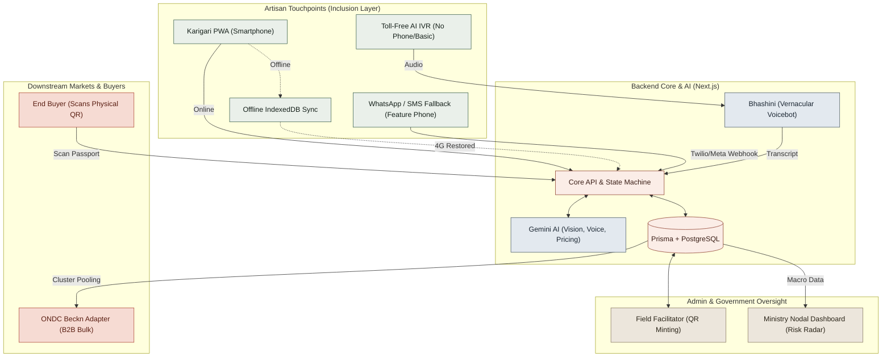
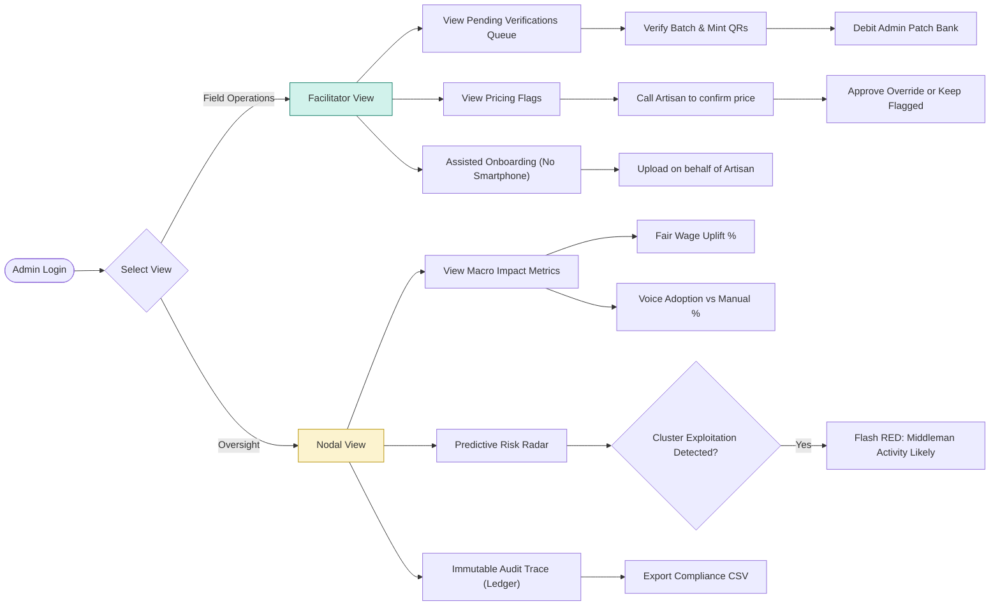
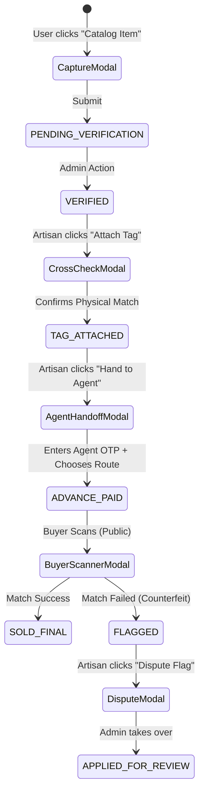
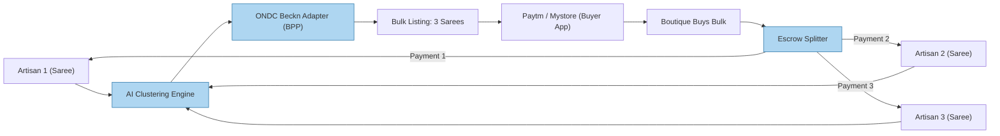

# KARIGARI — Comprehensive System Flowcharts

This document provides the complete visual architecture for the KARIGARI platform, including the new "10/10 SIH" resilience layers (Offline Sync, Toll-Free IVR, WhatsApp Fallback, and ONDC Cluster Pooling).

---

## 1. The Grand Architecture (Overall System Flow)

This flowchart illustrates how all the actors, fallback systems, AI agents, and external integrations (ONDC, DigiLocker, Razorpay) connect at a high level.



---

## 2. Artisan Workflow (End-to-End)

This flowchart tracks the exact journey of an individual artisan, from onboarding to getting paid, including the edge cases.

```mermaid
graph TD
  classDef default fill:#f9f9f9,stroke:#333,stroke-width:2px;
  classDef action fill:#d4e6f1,stroke:#2980b9;
  classDef ai fill:#e8daef,stroke:#8e44ad;
  classDef flag fill:#fadbd8,stroke:#c0392b;
  classDef success fill:#d5f5e3,stroke:#27ae60;

  START(["Start: Artisan Logs In"]) --> DASH["Artisan Dashboard"]
  
  DASH --> CAPTURE["Initiate Cataloging"]:::action
  
  CAPTURE --> VOICECAPTURE["Step 1: Voice Dictation (Local Language)"]
  VOICECAPTURE -->|API Call| GEM_STT["Gemini AI: Extracts Craft, Labor Days, Material Cost"]:::ai
  
  GEM_STT --> PHOTOCAPTURE["Step 2: Upload/Take Photo"]
  PHOTOCAPTURE -->|API Call| GEM_VIS["Gemini AI: Authenticates Craft + Generates English Copy"]:::ai
  
  GEM_VIS --> VALUATION["Step 3: AI Fair Wage Calculation"]:::ai
  VALUATION --> PRICING["Artisan enters Asking Price"]
  
  PRICING --> GUARD{"Is Asking Price < 70% of Fair Wage?"}
  GUARD -->|Yes| FLAG["Save Item (pricingFlag = true)"]:::flag
  GUARD -->|No| PENDING["Save Item (PENDING_VERIFICATION)"]
  
  FLAG --> FAC_INTERVENTION["Facilitator Investigates (Calls Artisan)"]:::action
  FAC_INTERVENTION -->|Overridden| PENDING
  
  PENDING -.->|Waiting| VERIFIED["Admin Mints QR Patch (Status: VERIFIED)"]
  
  VERIFIED --> XC["Cross-Check Modal: Artisan confirms QR match"]:::action
  XC --> TAGGED["Status: TAG_ATTACHED"]
  
  TAGGED --> HANDOFF["Agent Handoff Modal (Give item to Delivery)"]:::action
  HANDOFF --> OTP["Input 4-Digit Agent OTP"]
  
  OTP --> ADV["Advance Paid (40% UPI Escrow)"]:::success
```



---

## 3. Admin Workflow (Facilitator & Nodal)

The Admin panel is split into two distinct views depending on the task: Field Operations (Facilitator) vs Government Oversight (Nodal).



---

## 4. Buyer Authentication & Market Flow

This is the flow executed when a buyer scans the physical product, ensuring it's not a counterfeit.

```mermaid
graph TD
  classDef buyer fill:#f0e68c,stroke:#b8860b;
  classDef ai fill:#e8daef,stroke:#8e44ad;
  classDef db fill:#d5f5e3,stroke:#27ae60;
  classDef flag fill:#fadbd8,stroke:#c0392b;

  SCAN(["Buyer Scans Physical QR Code"]) --> BROWSER["Opens Public Web Passport (No App Needed)"]:::buyer
  BROWSER --> PASSPORT["View Story, Artisan Name, and Fair-Wage Proof"]
  
  PASSPORT --> PROMPT["Prompt: 'Verify Authenticity to release final payout'"]
  PROMPT --> CAM["Buyer Takes Live Photo of the Weave"]:::buyer
  
  CAM --> API["POST /api/verify-authenticity"]
  API --> GEM["Gemini Vision: Compare Live Photo vs Original DB Photo"]:::ai
  
  GEM --> MATCH{"Similarity Score >= 75%?"}
  
  MATCH -->|Yes (Authentic)| SUCCESS["Status: SOLD_FINAL"]:::db
  SUCCESS --> PAYOUT["Trigger Razorpay API: Final Payout to Artisan"]:::db
  
  MATCH -->|No (Counterfeit/Blurry)| GRACE{"Attempts < 10 & Time < 5 mins?"}
  GRACE -->|Yes| RETRY["Soft Reject: Ask buyer to try different angle"]
  GRACE -->|No| PERM_FLAG["Status: FLAGGED (Counterfeit Suspected)"]:::flag
  PERM_FLAG --> HEALTH["Artisan Health Score Deducted (-15)"]:::flag
```

---

## 5. The Interconnected Modal State Machine

This diagram shows how the individual UI Modals are linked sequentially based on the `CraftItem.status`.



---

## 6. ONDC B2B Cluster Pooling Flow (Advanced)

How individual artisans serve massive B2B wholesale orders.


