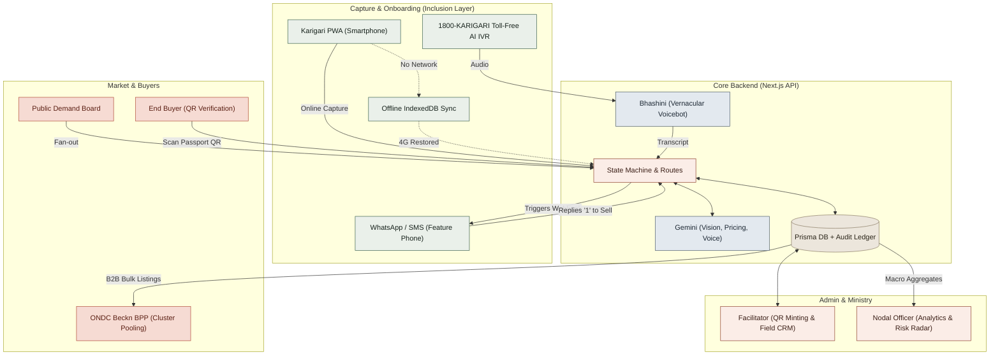
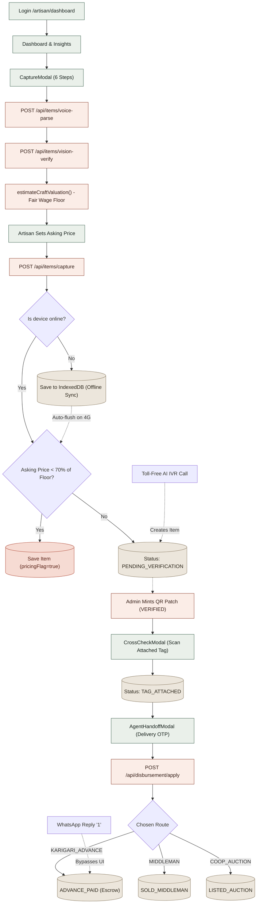
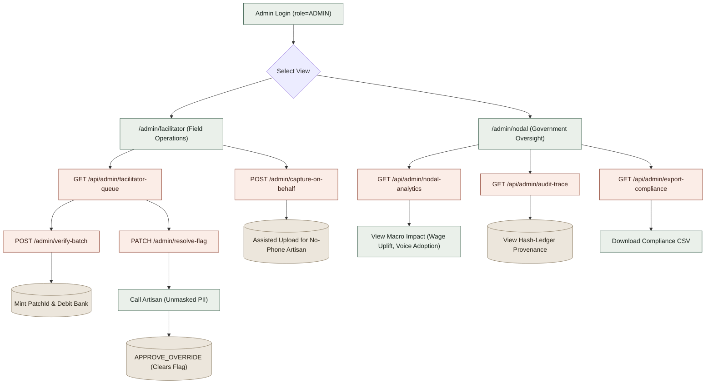
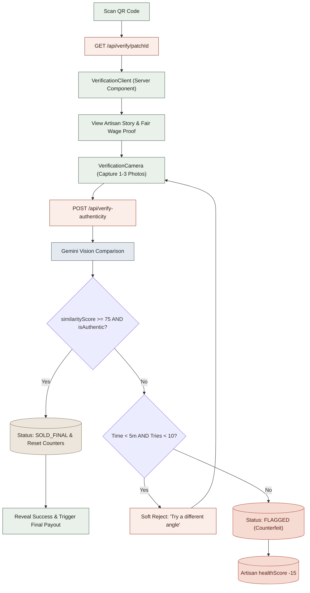
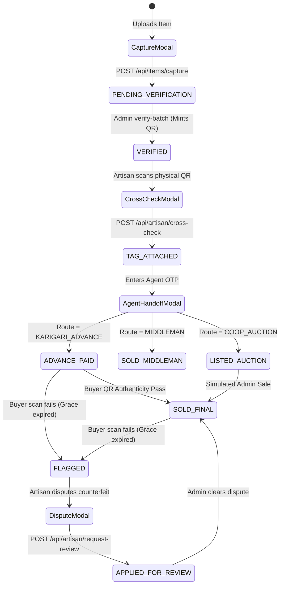
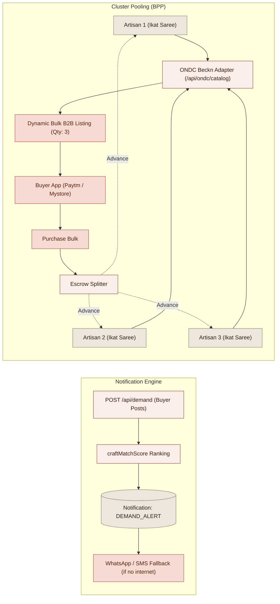

# KARIGARI — Master System Flowcharts

> **Note:** These flowcharts are strictly modeled after the exact state transitions and architectural boundaries defined in the official WORKFLOW.md, incorporating the core Next.js routing, AI logic, and the Advanced SIH resilience layers.

---

## 1. The Overall Master Architecture

This high-level flowchart shows the interconnected flow of data from the initial rural upload, through government oversight, and ultimately to the final buyer and ONDC wholesale markets.



---

## 2. Artisan End-to-End Workflow

This chart tracks an artisan's exact path through the UI (/artisan/dashboard), incorporating the 6-step capture, pricing guards, handoff, and the new offline/telecom fallbacks.



---

## 3. Admin Workflow (Facilitator vs Nodal)

The system splits admin tasks strictly by operational scope: Field actions with PII (Facilitator) vs Government macro-oversight without PII (Nodal).



---

## 4. Buyer Authentication Workflow

The exact sequence when a consumer scans a physical QR code (Public route, no authentication required).



---

## 5. The Interconnected Modal State Machine

Every modal in the UI strictly maps to a single CraftItem status transition.



---

## 6. ONDC B2B Cluster Pooling & Demand Notification

How individual items are aggregated for massive wholesale orders, and how demand filters down.



---

## 7. V9 — Demand & Order Synchronisation

The chain from a buyer posting a request to the artisan being credited. Every
box is a real endpoint; every cylinder is a row that actually gets written.

```mermaid
graph TD
    subgraph Buyer1 ["1. Raise a demand"]
        D1[/buyer · Raise a Demand<br/>5 sections] --> D2[POST /api/demand]
        D2 --> D3[(Demand: category, productType, sizeSpec,<br/>customisation, requiredBy, deliveryMode,<br/>purchaseType, 4 reference images,<br/>5 flexibility fields)]
        D2 --> D4[notifyArtisansForDemand]
        D4 --> D5{craftMatchScore > 0?}
        D5 -- No --> D6[No alert. Never notified.]
        D5 -- Yes --> D7[scoreArtisanForDemand<br/>craft 50 · material 15 · category 10<br/>colour 10 · location 10 · capacity 5]
        D7 --> D8[(Notification per artisan, cap 25<br/>message + 'Why you: ...' reason)]
        D7 -. best effort, all errors swallowed .-> D9[Twilio SMS · 160 chars]
        D2 --> D10[(BuyerNotification DEMAND_MATCHED<br/>only when someone was reached)]
    end

    subgraph Artisan1 ["2. Accept and work"]
        D8 --> A1[/artisan/orders · demands tab<br/>full request visible BEFORE accepting]
        A1 --> A2[POST /api/artisan/orders]
        A2 --> A3[(ArtisanOrder ACCEPTED<br/>Demand MATCHED)]
        A3 --> A4[(BuyerNotification ORDER_ACCEPTED)]
        A3 --> A5[POST /api/artisan/orders/log]
        A5 --> A6[(OrderLog + lastLogAt<br/>IN_PROGRESS · Demand IN_PRODUCTION)]
        A6 --> A7[(BuyerNotification DAILY_UPDATE<br/>throttled 1 per order per IST day)]
        A6 --> A8{No log for > 3 days?}
        A8 -- Yes --> A9[updateOverdue · nudge on the artisan page<br/>honest staleness line on the buyer card]
    end

    subgraph Ready ["3. Ready → Pack → Dispatch"]
        A6 --> R1[Ready sheet · QrScanModal<br/>scan the patch + photograph the piece]
        R1 --> R2[POST /api/artisan/orders/verify-ready]
        R2 --> R3{Patch owned by THIS artisan?}
        R3 -- No --> R4[403. Nothing written.]
        R3 -- Yes --> R5{Scanned QR = typed code?}
        R5 -- No --> R6[400. Nothing written.]
        R5 -- Yes --> R7[compareProductPhotos<br/>same prompt + MIN_SIMILARITY 75<br/>as the buyer's own check]
        R7 --> R8{score >= 75?}
        R8 -- No --> R9[200 · score returned · retry allowed<br/>NO state change · NO health penalty]
        R8 -- Yes --> R10[(craftItemId BOUND · readyVerified<br/>status READY)]
        R10 --> R11[(BuyerNotification ORDER_READY)]
        R10 --> R12[PATCH action pack · requires readyVerified]
        R12 --> R13[(packedAt · PACKED)] --> R14[(BuyerNotification ORDER_PACKED)]
        R13 --> R15[PATCH action dispatch · requires packedAt]
        R15 --> R16[(dispatchedAt · courier · tracking · DISPATCHED)]
        R16 --> R17[(BuyerNotification ORDER_DISPATCHED)]
    end

    subgraph Close ["4. Purchase, delivery, credit"]
        P1[Razorpay checkout · ?demand= rides through] --> P2[POST /api/payments/verify-payment<br/>HMAC is the trust boundary]
        P2 --> P3[(CraftItem SOLD_FINAL · displayed price<br/>NOT the 1 rupee actually charged)]
        P3 --> P4[(Notification PURCHASE to the artisan<br/>'pack and dispatch')]
        P3 --> P5[(BuyerNotification PURCHASE_CONFIRMED)]
        R16 --> C1[Buyer · Mark delivered]
        C1 --> C2[POST /api/buyer/orders/delivered]
        C2 --> C3{buyerName matches, case-insensitive?}
        C3 -- No --> C4[403]
        C3 -- Yes --> C5[(Demand FULFILLED · deliveredAt)]
        C5 --> C6[(Every uncredited ArtisanOrder credited ONCE<br/>at the agreed price · guarded on settledAt IS NULL<br/>status DELIVERED)]
        C6 --> C7[(Notification ORDER_DELIVERED to each artisan<br/>+ BuyerNotification ORDER_DELIVERED)]
        C6 --> C8[Buyer scan-verifies the delivery]
        C8 --> C9{Order has a bound craftItemId?}
        C9 -- Yes --> C10[artisanMatch requires THAT piece<br/>another piece by the same artisan now FAILS]
        C9 -- No, pre-V9 row --> C11[Falls back to the artisan-level check]
    end
```

### Where the two truths were reconciled

`GET /api/demand/track` used to follow `Notification.relatedDemandId` to the
artisans a request had merely *reached*, then keyword-match their inventory.
`GET /api/buyer/orders` counted only pieces carrying a verified payment. The same
demand could read "3 fulfilled" on the board and "0" in My Orders.

V9 makes `ArtisanOrder` the primary source for both, and both count an order
fulfilled when its resolved stage reaches `DELIVERED`. The old view survives only
when **no** order exists, and the response says `source: 'notifications'` so a
keyword guess is never presented as a commitment.
